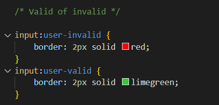

# Browser-Technologies

Week 1: Ideeën bedenken en basis opzetten. 
Ik heb het belastingdocument bekeken en de NS style bekeken.

Ik heb een begin voor een layout gemaakt met basisgegevens
Voor bepaalde gegevens moeten er manieren zijn om deze het best in te voeren.
- Voor datums met HTML input type maken waarbij alleen de huidige datum mogelijk is en niet later.
- Voor BSN en andere cijfers zorgen dat alleen cijfers volgens het juiste format mogelijk zijn. dus BSN maximaal 9 getallen
voor postcode 4 getallen en 2 letters, etc.
- Voor ja/nee opties zorgen dat, maar 1 optie tegelijk aangefinkt kan zijn.
- Als bepaalde delen niet relevant zijn na een bepaalde keuze dat, die delen automatisch overgeslagen worden.

Ook om het gebruik makelijker te maken zijn er nog een paar andere dingen.
- Bij bepaalde termen waarbij gebruikers misschien extra informatie nodig hebben, popups gebruiken om deze informatie te geven. 

Week 2: Uitwerking eerste html.

Ik heb de radio verbonden aan de tweede fieldset en vervolgens met JavaScript ervoor gezorgt dat pas als ja geselecteerd is de volgende
relevante vragen tevoorschijn komen. En als de JavaScript niet werkt het tweede deel van de form standaard in beeld is.
In de tweede html fieldset zijn de ja nee opties en vervangen met alleen een file inputtype voor degene waarvoor de label relevant is.
En de file input gestyled in de NS stijl.

Daarnaast heb ik valid en invalid toegevoegd aan de outputs. Zodat wanneer wat er in de input gezet wordt niet past bij de pattern
of de required in de input in html, de border rood wordt zodat het aangeeft welke input aangepast moet worden en als het wel valid is de border 
groen wordt om aan te geven dat het klopt.

Tot slot is er een submit button toegevoegd die zal leiden tot het volgende deel van de vragenlijst. Die ik volgende week zal maken.
En heb ik de pagina voor het grootste deel gestyled volgens de NS huisstijl en de CSS basis gelegd voor de rest van het formulier.

