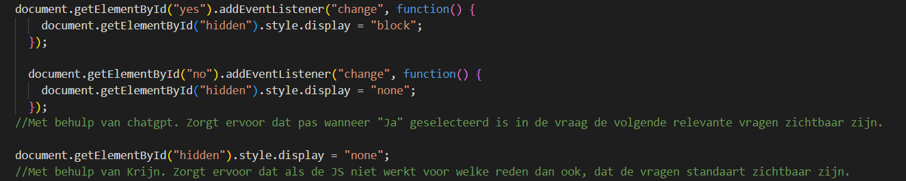
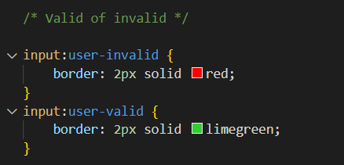
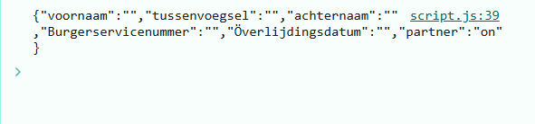
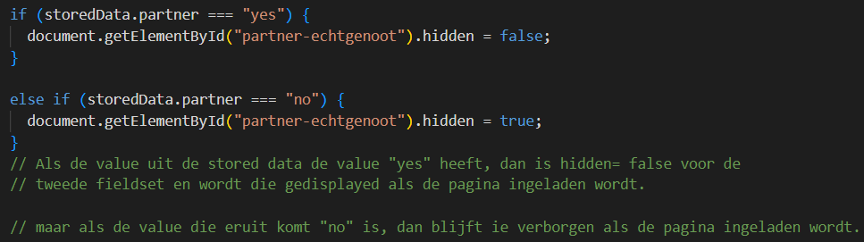

# Browser-Technologies

Week 1: Ideeën bedenken en basis opzetten. 
Ik heb het belastingdocument bekeken en de NS style bekeken.

Ik heb een begin voor een layout gemaakt met basisgegevens
Voor bepaalde gegevens moeten er manieren zijn om deze het best in te voeren.
- Voor datums met HTML input type maken waarbij alleen de huidige datum mogelijk is en niet later.
- Voor BSN en andere cijfers zorgen dat alleen cijfers volgens het juiste format mogelijk zijn. dus BSN maximaal 9 getallen
voor postcode 4 getallen en 2 letters, etc.
- Voor ja/nee opties zorgen dat, maar 1 optie tegelijk aangefinkt kan zijn.
- Als bepaalde delen niet relevant zijn na een bepaalde keuze dat, die delen automatisch overgeslagen worden.

Ook om het gebruik makelijker te maken zijn er nog een paar andere dingen.
- Bij bepaalde termen waarbij gebruikers misschien extra informatie nodig hebben, popups gebruiken om deze informatie te geven. 

Week 2: Uitwerking eerste html.

Ik heb de radio verbonden aan de tweede fieldset en vervolgens met JavaScript ervoor gezorgt dat pas als ja geselecteerd is de volgende
relevante vragen tevoorschijn komen. En als de JavaScript niet werkt het tweede deel van de form standaard in beeld is.
In de tweede html fieldset zijn de ja nee opties en vervangen met alleen een file inputtype voor degene waarvoor de label relevant is.
En de file input gestyled in de NS stijl.

Daarnaast heb ik valid en invalid toegevoegd aan de outputs. Zodat wanneer wat er in de input gezet wordt niet past bij de pattern
of de required in de input in html, de border rood wordt zodat het aangeeft welke input aangepast moet worden en als het wel valid is de border 
groen wordt om aan te geven dat het klopt.

Tot slot is er een submit button toegevoegd die zal leiden tot het volgende deel van de vragenlijst. Die ik volgende week zal maken.
En heb ik de pagina voor het grootste deel gestyled volgens de NS huisstijl en de CSS basis gelegd voor de rest van het formulier.

Week 3: Local storage en tweede deel van form.

In de ochtend heeft Jeremy Keith gepraat. Hij heeft het gehad over de verschillende manieren om data in het browser op te slaan. Voor local storage zijn er een paar opties.
- FormData API
-JSON stringify
- localStorage API

Aangezien wij met forms werken, lijkt de FormData API de beste optie, dus ben ik me daarover gaan inlezen.

https://developer.mozilla.org/en-US/docs/Web/API/FormData 
https://developer.mozilla.org/en-US/docs/Web/API/XMLHttpRequest_API/Using_FormData_Objects 

Maar omdat ik JavaScript nog heel moeilijk vind snap ik er echt helemaal niks van. 
Krijn heeft mij hierbij geholpen en hoe ik dingen kan opslaan in de localstorage, wanneer er een blur event plaatsvind in de input. Dus wanneer de focus weggaat van de input dan gaat de input in de localstorage. 

Zelf moest ik uitzoeken hoe, als de browser geopend wordt op de site, de browser gaat kijken of er iets in de localstorage staat en zo wel, dat deze informatie weer in de browser getoont wordt.

Met window.onload zorg ik ervoor dat pas als de hele pagina geladen is, gebeurt wat eronder staat. Dan met If, laat ik checken of er iets in de localstorage zit en zowel om die data op te halen met getItem. 
In de consolelog kon ik zien dat dit werkt.

Dan moet de data omgezet worden en terug ingevoerd in de input's.
Zelf heb ik het zover gekregen dat de de text inputs informatie krijgen, maar pas met behulp van Jeremy heb ik ook de radio-buttons data terug kunnen halen bij het inladen. 

Maar nu wanneer de radio op ja staat en opnieuw ingeladen wordt, opent het niet automatisch weer de tweede fieldset. Dat moet ik nog met Javascript toevoegen. Als het goed is al dan alles nog helemaal uitgeklapt zijn als de JS niet werkt. Dit ga ik volgende week in de laatste week doen en hopelijk nog een fieldset toevoegen met meer vragen, want wat ik nu heb is niet heel erg veel. 

Week 4: Local storage afmaken, bij inladen fieldset uitgeklapt of ingeklapt.

De radio buttons waren wel opgeslagen inn local storage, maar in html hadden ze geen value, waardoor de javascript alleen elke keer de eerste radio button in de form invulde met checked. 
het moest dus de value van de radio button ophalen en deze terug het formulier in zetten als deze opgehaald was. Met hulp van Krijn is de string geworden: var input = document.querySelector(`[name=${key}][value=${storedData[key]}]`)  if (input). Wat er dus voor zorgt dat de value uit de storedData opgehaald wordt en dan met de setAttribute wordt het in de input terug geplaatst. 

Dan was er nog het probleem dat de fieldset niet automatisch opende als de de value terug kwam met yes. Dat heb ik toen zelf weten te deon, met een if en if else.

De file input heeft een display: none; en user: valid of invalid werkt niet op de gestijlde label. 

Ik had eerst niet door waarom local storage niet werkte als ik meer fieldset toevoegde, maar merkte snel dat het kwam omdat de inputs of geen name hadden, of dezelfde name als andere inputs, wat dan niet werkt.

ik heb voor alle nieuwe fieldsets passend hidden toegepast zodat de fieldsets of sections alleen zichtbaar zijn als een bepaalde radio aangeklikt is. Bij alle fieldsets waar hidden toegepast is, als Javascript niet op de browser werkt, zullen ze gewoon zichtbaar zijn. Het hele formulier is dan zichtbaar. Het probleem wat dan komt, is dat de inputs die normaal verborgen zouden zijn voor mensen waarvoor ze niet relevant zijn, nu wel gedisplayed worden en dus ook required zijn als er dat in de html staat. Dus mensen kunnen dan niet verder met het formulier als zij deze gegevens niet invoeren, ook als zij deze gegevens niet hebben om te bieden.

Er kan hier een instructie komen, dat zij n.v.t. moeten invullen als dit het geval is. Het zou ook met :has kunnnen, maar dan als het op een browser gebruikt wordt dat :has niet support loop je alsnog vast.
Dus voor nu heb ik besloten om van een deel vand de inputs required weg te halen.

Alles in het formulier werkt nu, ookal is het niet veel. Het is wel veel wat op heel veel nieuwe delen toegepast kan worden als er aan het formulier toegevoegd wordt.